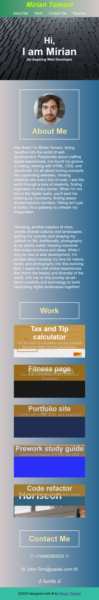

# CSS-Challenge-Professional-Portfolio

## Description
The Professional Portfolio is a meticulously crafted website that serves as a showcase of my skills and accomplishments. The primary goal was to showcase my expertise in web development, implementing advanced CSS techniques to ensure a polished, professional, and user-friendly interface.

## Distinctive webpage Features:

###  Sectional Structure:

• Divided the website into distinct segments: 'About Me,' 'My Work,' and 'Contact Info,' offering users a seamless navigation experience.

###  Functional Navigation:

• Positioned navigation links strategically to facilitate swift transitions between sections, enhancing user accessibility and fluid navigation.

###  Resume Integration:

• Included a link to a PDF version of my resume, providing supplementary information about my professional background, albeit not reflecting the most recent updates.

###  Personal Avatar Inclusion:

• Embedded an avatar photo within the interface, adding a personalized touch and establishing a connection between visitors and the digital persona.

###  My Work Showcase:

• Curated an array of projects, comprising bootcamp samples and placeholders awaiting future additions. Notably, completed projects were linked to deployed applications on GitHub, offering tangible demonstrations of work upon click.

###  Responsive Design:

• Employed advanced CSS techniques to ensure a responsive design adaptable to various screen sizes, catering to users across desktops, tablets, and mobile devices.

###  Hover Effects Implementation:

• Delicately integrated hover effects for links and showcased projects, enriching the user experience with interactive elements that respond gracefully upon interaction.

## Installation

Upload index.html, license.txt, and assets folder to the deployed webserver. The assets folder contains images and CSS files.

The deployed website linked was deployed using GitHub Pages.
[Link to the deployed website](https://john-991.github.io/CSS-Challenge-Professional-Portfolio/)

## Usage 

It it optimized for smaller screens.
[html link](index.html)

### Desktop Version

### Tablet Version

### Mobile Version

## Credits

Collaborators on this project included staff, TAs, and students in the EDX Boot Camp 2023 cohort. 

## License

Copyright (c) 2023 John-991

Permission is hereby granted, free of charge, to any person obtaining a copy
of this software and associated documentation files (the "Software"), to deal
in the Software without restriction, including without limitation the rights
to use, copy, modify, merge, publish, distribute, sublicense, and/or sell
copies of the Software, and to permit persons to whom the Software is
furnished to do so, subject to the following conditions:

The above copyright notice and this permission notice shall be included in all
copies or substantial portions of the Software.

THE SOFTWARE IS PROVIDED "AS IS", WITHOUT WARRANTY OF ANY KIND, EXPRESS OR
IMPLIED, INCLUDING BUT NOT LIMITED TO THE WARRANTIES OF MERCHANTABILITY,
FITNESS FOR A PARTICULAR PURPOSE AND NONINFRINGEMENT. IN NO EVENT SHALL THE
AUTHORS OR COPYRIGHT HOLDERS BE LIABLE FOR ANY CLAIM, DAMAGES OR OTHER
LIABILITY, WHETHER IN AN ACTION OF CONTRACT, TORT OR OTHERWISE, ARISING FROM,
OUT OF OR IN CONNECTION WITH THE SOFTWARE OR THE USE OR OTHER DEALINGS IN THE
SOFTWARE.
